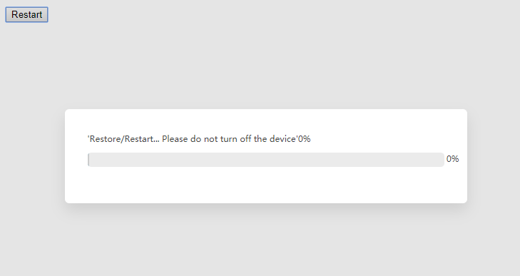

## 全局对话框组件 Modal

###　效果预览（modal.js）


### 如何使用

提供参数有：

+ title:标题
+ visible：显示和隐藏，默认为false隐藏
+ close:右边的关闭按钮
+ closeModel：关闭按钮的回调
+ style:根据需要改变内容的样式

示例

```jsx
import React from 'react';
import Modal from './modal'

function App() {
  return (
    <div >
      <Modal
        title={'Title'}
        style={{width:300}}
        visible={true}
        close={true}
        >        
          123
        </Modal>
    </div>
  );
}

export default App;
```

组件依赖

```
{
    "react": "^16.4.2"
}

```


## 进度条

### 效果预览(progress.js)



### 如何使用

提供参数有：

- visible：显示和隐藏，默认为false隐藏(必须是通过改变了属性值触发)
- locktime:倒计时
- handleRedirect：倒计时结束调用的函数

注意：该进度条是通过componentWillReceiveProps生命周期函数来触发倒计时的，所以它是需要接收到改变的参数后才会触发

```jsx

      componentWillReceiveProps(nextProps) {
        if (nextProps.visble===true) {
          this.handleOpen();
        }
      }
```


示例

```jsx
import React from 'react';
import Modal from './modal'
import Progress from './modal/progress'

class App extends React.Component {
  state={
    visble:false
  }
  handleRestart=()=>{
    this.setState({
      visble:!this.state.visble
    })
  }
  render() {
  return (
    <div >
      <button onClick={this.handleRestart}>Restart</button>
        <Progress 
            visble={this.state.visble} 
            locktime={20}
            handleRedirect={this.handleRestart}/>
    </div>
  );}
}

export default App;


```

组件依赖

```
{
    "react": "^16.4.2"
}

```

