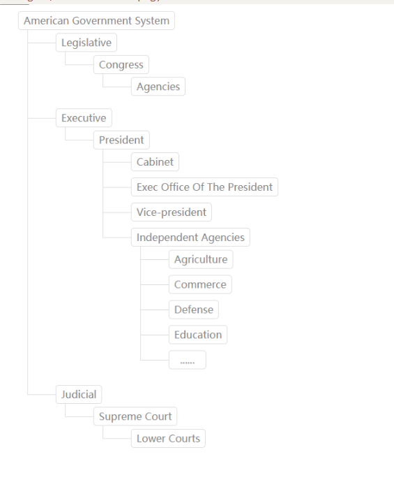

## Tree 树结构

###　效果预览（index.js）



### 如何使用

提供参数有：

+ node:树结构（树结构如下示例所示）

示例

```jsx
import React from 'react';
import Tree from './tree'

var tree = {
  title: "American Government System",
  childNodes: [
    {
      title: "Legislative", childNodes: [
        {
          title: "Congress", childNodes: [
            { title: "Agencies" }
          ]
        }
      ]
    },
    {
      title: "Executive", childNodes: [
        {
          title: "President", childNodes: [
            { title: "Cabinet" },
            { title: "Exec Office Of The President" },
            { title: "Vice-president" },
            {
              title: "Independent Agencies", childNodes: [
                { title: "Agriculture" },
                { title: "Commerce" },
                { title: "Defense" },
                { title: "Education" },
                { title: "......" }
              ]
            }
          ]
        }
      ]
    },
    {
      title: "Judicial", childNodes: [
        {
          title: "Supreme Court", childNodes: [
            { title: "Lower Courts" }
          ]
        }
      ]
    }
  ]
};

function App() {
  return (
    <div >
    <Tree node={tree}></Tree>
    </div>
  );
}

export default App;
```

组件依赖

```
{
    "react": "^16.4.2"
}

```


